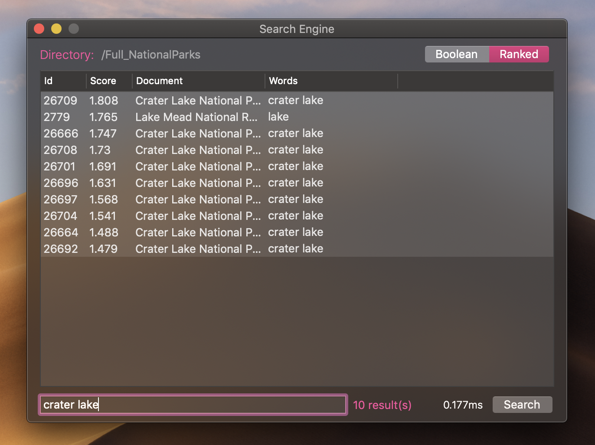

# Search Engine

  

<p  align="center">


</p>

  

This project has been built for educational purposes, and **fun !**

It is actually part of a graduate-level computer science class : Search Engine Technology.


## Concept

This is a simplified version of a Search Engine. The purpose has nothing to do with research, or doing better than any real search engine that currently exists. The purpose of this project is to understand the Information Retrieval fundamentals and apply them on a native Cocoa environment, pushing Swift limits !

In **simple** what does it do ?

To perform queries to search for words within a defined set of documents, an search engine needs an "index". We will therefore generate an index for a directory you provide. 

First, all the files in the directory are listed, an ID is tied to each file, and a factory to interpret the content. Words are read one by one as tokens for each file, sanitized and stemmed. Each unique word will be stored in a on-RAM index at first, and associated with the file that holds it (plus extra information such at positions in file). When all tokens have been processed, with generate a second index (K-Gram) that will be useful for wildcard queries. Finally, both indexes are written in a binary format in four binary files.
One file contains the utf8 representation of words, one file contains the Postings data, one has the file weights, and the final one is an associative table.

When you load an environment, the engine locates the binary files, open them.
When you trigger a query, the query will be parsed, and split in subqueries if needed.
The engine will access the data in the binary files, by doing offset jumps, seeks and binary searches. Calculations are needed in ranked mode to attribute scores.

A brief list of concepts that are implemented

 - Document Corpus
 - Ranking (ld/tf-idf formulas)
 - Positional Inverted Index
 - DSP Index on Disk (Document Score Positions)
 - Token Stemming (Porter Stemmer 2)
 - Spelling Correction (Jaccard Index, Edit Distance)
 - Postings Mechanism
 - Boolean Query Parser
 - Wildcard Queries
 - Token Processor
 - K-Gram/N-Gram Index
 - Binary Files, offsets and seeks
 - Binary Search in Binary Files
 - Data Encoding
 - Swift StreamReaders, Data & Buffers
 - Swift Priority Queue/ Binary Heap
 - Swift Dictionaries and COW behavior
 - Swift Dispatch Queues
 - Swift Generics, Unsafe Pointers
 - More

## Instructions

  The search engine has to index a directory in order to search in its documents.
  You will first create a new environment by specifying the directory you wish to index.
  Doing so will create a ```.index``` folder in it, containing data about the corpus.
  When you load an environment, the engine is read to perform queries,

1. Run the app
2. Create a new environment (```⌘N```)
3. Load the environment (```⌘O```)
4. Run queries

The Search Engine actually only accepts plain *.txt files*, and *.json files* with a 'body' element in it.

  

## Queries

  

The Search Engine accepts two kinds of query modes :

  ### Boolean Retrieval Mode:

**Example** : the query [this word + "or those" + wo*ds]

  

Will retrieve documents with either

  

- the term 'this' AND the term 'word'

OR

- the term 'or' immediatly followed by the term 'those'

OR

- any word matching the pattern wo*ds

### Ranked Mode

In ranked mode, queries are processed as a *bag of words*. The engine will calculate a score for each document containing a term within your query. The ten top results are then displayed.