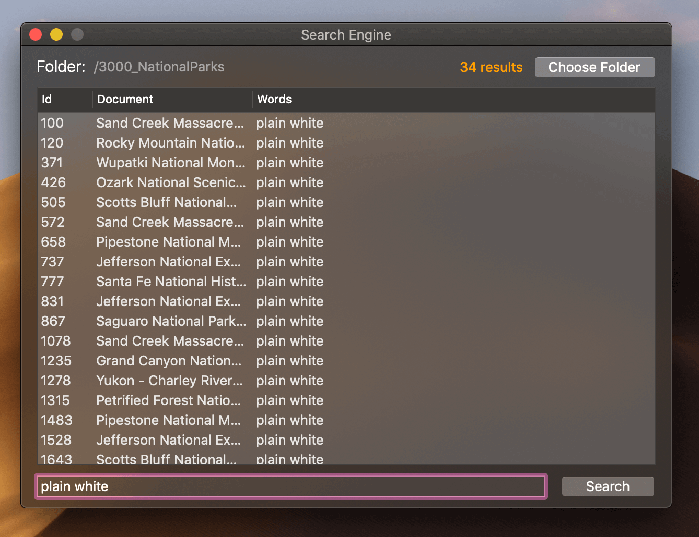

# Search Engine

    

This project has been built for educational purposes, and **fun !**
It is actually part of a graduate-level computer science class : Search Engine Technology.

## Instructions

Run the app, select a directory containing files that you wish to index, and run queries.
The Search Engine actually only accepts plain *.txt files*, and *.json files* with a 'body' element in it.

## Queries

The Search Engine accepts boolean queries.

**Example** :  the query [this word + "or those" + wo*ds]

Will retrieve documents with either

- the term 'this' AND the term 'word'
OR
- the term 'or' immediatly followed by the term 'those'
OR
- any word matching the pattern wo*ds 